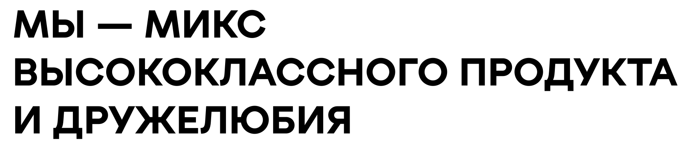
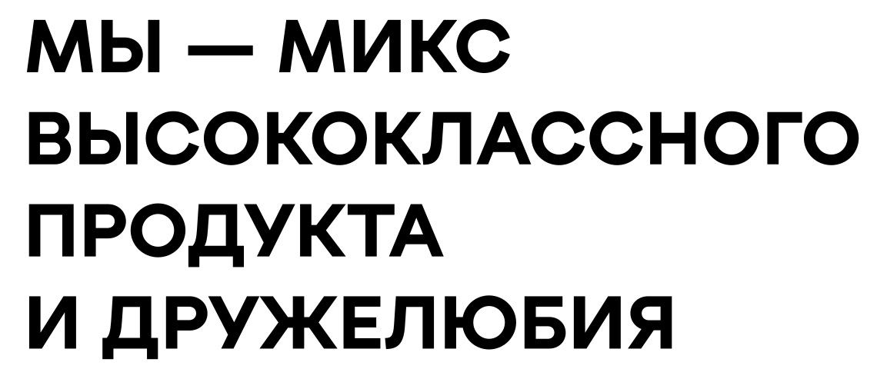

# Правила вёрстки AHFT (Honey-Hookah Landing)

Сайт: Vite + Tailwind v4 + TypeScript. Стили описываются токенами в `src/style.css`,
разметка — в `index.html`. Сборка: `npm run build` (= `tsc --noEmit && vite build`).
Общение с пользователем — на русском.

## Глобальное правило (действует до явной отмены)

**Все изменения — ТОЛЬКО десктоп (md+). Мобильная вёрстка (< md) не меняется.**
Исключение — только по явному указанию пользователя. Десктопные правки нельзя
делать так, чтобы они меняли внешний вид/поведение на мобилке; при добавлении
стилей и разметки мобильные версии классов (`md:*`, `<md`) оставлять как есть.

## Система отступов (обязательная)

**Все отступы кратны 4 и берутся ТОЛЬКО из фиксированного набора.**
Произвольные значения (`mt-[50px]`, `mb-15`, `mb-5`) ЗАПРЕЩЕНЫ.

| Значение | = px   | Где применяется |
|----------|--------|-----------------|
| `4`      | 16px   | внутр. карточек, поля списка ароматов, мелкие пары |
| `6`      | 24px   | заголовок→текст, между блоками внутри секции |
| `8`      | 32px   | крупные зазоры блоков (карта→карточка, gap-8) |
| `10`     | 40px   | кнопка героя под h1 (`mt-10`), широкие внутр. зазоры |
| `12`     | 48px   | вертикальные отступы секции на мобильных (`py-12`) |
| `16`     | 64px   | вертикальные отступы секции на мобильных (`py-16`) |
| `20`     | 80px   | широкие внутр. зазоры на десктопе (применяется в Hero, `pt-20` при необходимости) |
| `28`     | 112px  | вертикальные отступы секции на десктопе (`md:py-28`) |

## Единые шаблоны секций

Каждая секция (`<section>`) обязана использовать эти классы как есть:

```
<section class="py-12 md:py-28">
  <div class="mx-auto max-w-[1100px] px-5">   <!-- контейнер всегда -->
    <h2 class="mb-4 text-[1.65rem] font-bold uppercase tracking-[-0.5px]
               md:mb-6 md:text-[2.6rem] md:tracking-[-1px]">Заголовок</h2>
    <p class="mb-4 max-w-[600px] text-[clamp(1.1rem,3vw,1.375rem)] leading-[1.5] text-mute">
      Интро-абзац</p>
</section>
```

- НЕ менять отступы одной секции, не сверив с остальными — у всех секций одинаковые
  `py-12 md:py-28`, одинаковый h2 с `mb-4 md:mb-6`, одинаковый контейнер.
- Зазоры между блоками внутри секции: `mt-6`, `gap-6`/`gap-8`; между полями формы
  и элементами списков: `gap-4`/`gap-6`; между колонками форм на десктопе: `gap-20`.
- Вертикальный ритм списков: `py-2.5` + `border-b border-line` + `last:border-b-0`.
- **Единственное исключение** — Hero: `<section class="flex items-start pt-28">`,
  без нижних/боковых отступов; заголовок `h1` c `mb-8` (и БЕЗ `mt-*` — верхний отступ
  даёт `pt-28`), кнопка `mt-10`.
  НА МОБИЛКЕ (`<md`) ПО ЯВНОЙ ПРОСЬБЕ: у `h1` добавлен `mt-5` (20px, НЕ из шкалы —
  «заголовок отпусти ниже на 20 px»; на `md` снят `md:mt-0`) и увеличен шрифт:
  `text-[clamp(2.2rem,10.1vw,4.95rem)]` вместо `8.8vw`, на `md` прежний
  `md:text-[clamp(2.2rem,8.8vw,4.95rem)]` (десктоп не менялся). Шрифт подобран так,
  чтобы НИЖНЯЯ строка «для мастеров» ложилась в ширину контента одной строкой
  (замеры `<md`: 414→367/374, 390→346/350, 375→333/335, 360→320/320; на 320 места
  нет — строка переносится на 5 строк, без overflow). Отступ меню→h1 на мобилке
  стал 52px (32px + 20px).

## Навигация

- Мобильное таб-меню `.tabbar` (иконки, fixed-центр снизу) УДАЛЕНО ПО ПРОСЬБЕ
  («убери таб меню в мобильной версии»): разметка `<nav class="tabbar md:hidden">`
  вынесена из `index.html`, весь CSS `.tabbar*` (включая тёмные оверрайды,
  `prefers-reduced-motion`, `.catalog-spin`) удалён из `src/style.css`,
  `.tabbar` убран из hideables в `src/motion.ts`. НЕ возвращать без явной просьбы.
  CSS-файл `spin-strip.webp` и `src/catalogSpin.ts` остаются в проекте, но
  `.catalog-spin` в DOM нет — `initCatalogSpin` безвреден (`if (!el) return`).
- Навигация (`data-nav="#…"`) — в `header nav` на ВСЕХ ширинах
  (ссылки «Где купить»/«Партнёрам»/«Контакты»: `#where`, `#join`, `#values`;
  каталога в навигации нет). Активный раздел (`.is-active`)
  синхронизируется через `src/tabBar.ts`.
  Контейнер header ПО ПРОСЬБЕ ПОКАЗАН И НА МОБИЛКЕ (`flex`, раньше `hidden md:flex`):
  «меню размести в верхней части экрана как на десктопе без фикса».
  Структура header: `<div class="mx-auto flex max-w-[1100px] flex-col items-stretch
  px-5 pt-9 md:relative md:h-20 md:flex-row md:items-start md:justify-end md:pt-[31px]">`,
  внутри: кнопка темы (`#theme-logo`, на мобилке в потоке сверху справа,
  на `md+` — absolute, см. ниже), сразу, потом nav.
- На мобилке меню стоит ОТДЕЛЬНОЙ СТРОКОЙ НИЖЕ ЛОГО (лого — fixed слева,
  на мобилке 36..134px): кнопка темы сверху справа (`pt-9` = 36px, в потоке,
  НЕ fixed), затем `nav` с `mt-[88px]` (36px кнопка + 88px → меню на Y = 164..190,
  зазор под лого 30px). `nav` — `flex w-full flex-wrap items-center
  gap-[25px]` (без `justify-between`): ПО ЯВНОЙ ПРОСЬБЕ «сделай отступ между
  словами в меню в мобилке 25 px» из класса УБРАН `justify-between` (раньше
  пункты РАЗНОСИЛИСЬ по всей ширине контента — фактические зазоры ~54px на
  390, а `gap-[25px]` был только минимальным зазором). Теперь зазор МЕЖДУ
  пунктами РОВНО 25px, пункты прижаты влево: на 390/360 «Где купить» 20..101,
  «Партнёрам» 126..214, «Контакты» 239..312, зазоры 25/25px, overflow нет;
  на 320 (контент 280px) «Контакты» ПЕРЕНОСИТСЯ на вторую строку (292px не
  влезает), зазор первой строки 25px, overflow от меню нет (общий 347px на
  320 — прежний от дропов каталога, вне scope). `gap-[25px]` — НЕ из шкалы
  отступов. На `md+` ПО ПРОСЬБЕ
  «меню в десктопе сделай в один столбец (три строки)»: `nav` —
  `md:w-auto md:flex-col md:items-start md:gap-y-2 md:mr-[200px]` — ВСЕ ТРИ
  ссылки СТЕКОМ по одной в столбец (обёртка просто `contents` на всех ширинах;
  «Где купить»/«Партнёрам»/«Контакты» Y 31/65/98, ширина колонки 88px на 1440).
  ЛЕВЫЙ КРАЙ МЕНЮ СОВПАДАЕТ С ЛЕВЫМ КРАЕМ РАЗДЕЛИТЕЛЬНОЙ ЛИНИИ НАД СЛОВОМ
  «Линейки» (это `border-t` первой строки dl-колонки hero, «выравни меню по
  разделительной линии над слово Линейки»): `md:mr-[200px]` (произвольный,
  по просьбе): на 1440/1100/1024 nav.l = dl.l = 962/792/716, Δ=0px (раньше
  было 952 по кнопке «Каталог ароматов» с её translate −10 — отменено).
  На 900/769 правая колонка hero сужается (243/197px) и уходит вправо,
  а nav остаётся на content_r−288 — Δ 45/91px, перекрытий НЕТ (приемлемо).
  Покрыто headless-замерами на
  390/360/320/769/900/1024/1100/1440: перекрытий меню/лого/кнопки темы нет
  (overlap = 0), горизонтального overflow от header нет.
- Отступ между меню и заголовком hero на МОБИЛКЕ сокращён (по просьбе
  «сократи отступ между меню и заголовком в мобилке»): у `main` в
  `src/style.css` убран дефолтный `margin-top: 100px` только для `<md`
  (`@media (min-width: 48rem) { main { margin-top: 100px } }` остаётся):
  на мобилке зазор меню→h1 = 32px (nav bottom 190 → h1 top 222), раньше 132px.
- Логип AHFT — fixed-плашка, выровнена по линии контента
  (`left-[max(20px,calc((100vw_-_1100px)_/_2_+_20px))]`), на мобилке = 20px.
  SVG (`img`, `theme-invert-mark`): на `md+` — `h-[107px]` (143px ширина),
  на мобилке ПО ПРОСЬБЕ ЗАМЕНЁН ТЕКСТОВЫЙ ЛОГОТИП (спаны A.H.F./Tobacco
  УДАЛЕНЫ) на тот же SVG — на мобилке `block h-[98px] w-auto md:h-[107px]`
  (мобильный размер 131×98px — прежние 49px УВЕЛИЧЕНЫ НА 100% по просьбе
  «логотип вверху увеличь на 100% на мобилке»).
  `src/motion.ts` скрывает `a[aria-label="AHFT — на главную"]` при пролистывании.
- Тогл темы — ДВЕ кнопки (обе переключают тему одним обработчиком):
  - `#theme-logo` — на мобилке (`<md`) в шапке справа ВВЕРХУ, НЕ fixed,
    в потоке (`pt-9` контейнера → top 36..76, `ml-auto` прижимает вправо;
    по просьбе «без Фикса» — ранее была fixed). Скрыта на `md+` (`md:hidden`).
  - `#theme-logo-desktop` — на `md+` в подвале (см. раздел «Подвал»):
    `hidden md:flex`, скрыта на мобилке.
  `src/theme.ts` привязывает клик к `querySelectorAll('#theme-logo,
  #theme-logo-desktop')`. Из `motion.ts` hideables удалён (класса `is-hidden`
  у него нет).

## Двухколоночный десктоп (md+)

Часть контента на `md+` раскладывается в две колонки внутри того же контейнера
`mx-auto max-w-[1100px] px-5` (контент ~1060px + отступ по краям). Мобайл не трогать:
на `<md` весь контент остаётся одной колонкой в исходном порядке DOM.

- **О продукте** и **Каталог** — ОДНОколоночные на всех экранах: абзацы в стейк
  (у второго `mt-6`), линейки Blansh/Nuar стейком на всю ширину. Шапка Каталога
  на `md+` — маленький eyebrow `Каталог ароматов` (было `Ассортимент`; классы
  те же, `uppercase`), h2 `Каталог ароматов` УДАЛЁН («сам заголовок удали»).
  ПО ЯВНОЙ ПРОСЬБЕ («добавь текст над лого Blansh КАТАЛОГ АРОМАТОВ») eyebrow
  теперь НА ВСЕХ ШИРИНАХ (снят `hidden md:block` → `mb-4 … uppercase`), на
  мобилке он стоит НАД лого Blansh (зазор 16px на 390/360/320, десктоп прежний
  32px за счёт `md:mt-8` обёртки). Ниже подзаголовок
  (`h3` `Blansh — лёгкий кальянный табак на основе европейского листа Вирджиния`), — на
  мобилке подзаголовок линеек — мобильный логотип + метка
  (`md:hidden`) ПЕРЕД скрытым подзаголовком и гридом. ПО ЯВНОЙ ПРОСЬБЕ
  («перенеси с десктопа в мобилку лого blansh и Nuar и подзаголовки с блока
  Каталог Ароматов») на `<md` теперь ПОКАЗАНЫ ТЕ ЖЕ ДЕСКТОПНЫЕ логотипы
  (`blansh_logo.svg`/`nuar_logo.svg`) и те же h3-подзаголовки, что на `md+`
  (классы `hidden md:block` сняты → `block`; на мобилке под h3 `mt-4` = 16px
  — «добавь отступ от лого к подзаголовку», было `mt-2`,
  на десктопе порядок/классы прежние `md:mt-0` и т.д.). Мобильные логотипы
  `b_full-logo_inverse.svg`/`n_full-logo.svg` и мобильные метки «Линейка табака
  … крепости» УДАЛЕНЫ (заменены перенесёнными с десктопа). ФИЛЬТР АРОМАТОВ
  (`#aroma-filters`, `.filter-chip`, `FAMILIES`, `initFamilyFilter`, правило
  `#catalog li.is-hidden`) УДАЛЕН ПО ПРОСЬБЕ — НЕ возвращать. Все ароматы
  показываются всегда, скрытых карточек нет.
  Обёртка блока подзаголовка Blansh — `mb-8 md:mb-[39px] md:mt-8` (отступ
  был `md:mt-[100px]` под удалённый h2 — при удалении h2 «подтянули к нему
  список ароматов», итог подпись→первый аромат = 170px).
  Перед каждым десктопным подзаголовком (`h3`) стоит бренд-логотип —
  `assets/blansh_logo.svg` (`alt="Blansh"`) и `assets/nuar_logo.svg`
  (`alt="Nuar"`): Blansh `h-[44.6px]` (=39.6px +5px по просьбе, ширина
  177.7px на 1440), Nuar `h-9` (36px, 163px). На `<md` они видимы (см. выше).
  Логотип и подзаголовок каждой линейки (Blansh и Nuar) — в ОДНОМ РЯДУ на
  `md+`: логотип прижат к ЛЕВОМУ краю контента; обе обёртки
  `md:flex md:gap-4 md:items-start` (лого и подзаголовок по ВЕРХНЕМУ краю;
  у Blansh `md:justify-between` НЕ используется — блок якорен по левому
  краю, у Nuar стоит `md:justify-between`). Ширина h3:
  Nuar — `md:max-w-[calc((100%_-_2rem)/2)]` (по формуле колонок #about);
  Blansh — `md:max-w-[min(424px,calc(50%_-_11px))]` + `md:ml-[calc(50%_-_200px)]`
  — РОВНО 3 СТРОКИ на всех `md+` (424px = максимум для 3 строк, 428 уже 2;
  min(..) защищает от overflow на 769, там 353px) и левый край у 2-й
  колонки #about. Позиции (визуальные): ОБА = колонка #about − 5 (Blansh без translate —
  якорь `ml-[calc(50%_-_200px)]` уже даёт col−5; Nuar через
  `md:-translate-x-[5px]` «левее на 5px»):
  1440: Blansh 731..1155 (3 стр) / Nuar 731..1245 (3 стр);
  1100: 561..985 / 561..1075; 769: 396..749 (3 стр / w=353) / 396..744 (4 стр).
  Сдвиги: после «правее на 10px» у Blansh translate убран; было −10 (−15 от колонки).
  Зазор подзаголовок→список ароматов = 39px на `md+` у ОБЕИХ линеек
  (было 60px — «подними на одну строку» = −21px, строка аромата):
  обёртки `md:mb-[39px]`, сетки ароматов `md:mt-0`.
  Мобилка: Blansh `mb-8`, Nuar зазор через `mt-6` сетки — не тронуты.
  Логотипы +10%: Blansh `h-[49.06px]` (195x49), Nuar `h-[39.6px]` (180x40).
  У Blansh обёртка была `md:justify-between` — убрано при «сохрани выравнивание».
  Оба лого чёрные (`fill: #000`); в тёмной теме инвертируются существующим
  правилом `:root.dark #catalog img[alt="Blansh"/"Nuar"]` (потому alt
  «Blansh»/«Nuar» обязательны). Названия файлов менять нельзя.
  Дропы каталога:
  на мобилке НЕ ТРОГАТЬ — flex-скролл по дропам (`flex gap-6 overflow-x-auto`,
  дети `min-w-[200px] shrink-0 flex flex-col`, внизу колонки подпись
  `drop#N` с `mt-auto`), на `md+` — плоский грид по 4 колонки у ОБЕИХ линеек:
  `md:grid md:grid-cols-[repeat(4,minmax(0,1fr))] md:gap-6`. Дропы на `md+`
  раскрываются через `md:contents` на обёртке дропа и `ul` (карточки текут
  в грид по порядку DOM), нижняя подпись `drop#N` скрывается `md:hidden`.
  РИТМ СПИСКА АРОМАТОВ НА МОБИЛКЕ (по просьбе «расстояние между названием
  аромата и разделителями сверху и снизу разное — сделай одинаковыми»): у
  ВСЕХ 11 `<ul class="mt-4 flex list-none flex-col …">` из класса УДАЛЁН
  `gap-4` (осталось `flex list-none flex-col md:contents`). Причина: между
  строками был `gap-4` (16px) + `py-2` (8px) у каждой строки → текст был
  в ~28px от ВЕРХНЕГО разделителя (чужой `border-b` предыдущей строки) и в
  ~13px от НИЖНЕГО — визуально разное расстояние. Без gap зазоры симметричны:
  8px паддинг со всех сторон, замер (390, ink-метрики шрифта): обычно
  12.7 сверху / 11.1 снизу (погрешность ~1px — сам border и полуприпуски
  шрифта; строки с «Й» дают 8.9 сверху из-за гачек над прописной — это
  форма глифа, не вёрстка). ДЕСКТОП НЕ ЗАТРОНУТ: на `md+` у `ul`
  `display: contents` — gap и так не применялся (проверено 1440:
  ulDisplay=contents, border-b=0, описания видны, грид 4 колонки).
  Не возвращать `gap-4` в эти `ul`.
  Карточка аромата — `<li class="py-3 md:py-2 border-b border-line
  last:border-b-0 md:rounded-none md:border-0 md:min-w-0" data-aroma="…">`:
  имя (`block whitespace-nowrap text-[1.03rem] leading-tight`) и описание
  (`hidden md:block text-[0.85rem] leading-[1.45] text-mute md:mt-2`), БЕЗ
  обводки и БЕЗ тега дропа на `md+` (тег `drop#N` только на мобилке внизу
  колонки). НА МОБИЛКЕ центр-строки:
  `py-3 border-b border-line last:border-b-0` — паддинг ПО ОБЕ СТОРОНЫ ОТ
  НАЗВАНИЯ 12px (по просьбе «12px паддинг по обе стороны от названия»,
  было `py-2` 8px; `md:py-2` возвращает 8px на десктопе — десктоп не менялся),
  без описания (описание в попапе).
  Попап на мобилке (`.aroma-overlay`/`.aroma-popup` в секции `#catalog`): тап по
  `li[data-aroma]` открывает оверлей-модалку с названием и описанием (текст
  берётся из DOM карточки, `initMobilePopup` в `src/aromas.ts`), закрытие —
  крестик/клик по оверлею/Esc; на `md+` попап не открывается (`matchMedia
  '(max-width: 767px)'`). Названия ароматов
  всегда в одну строку (`whitespace-nowrap`); подзаголовки линеек —
  `Blansh — лёгкий кальянный табак на основе европейского листа Вирджиния` и
  `Nuar — табак для кальяна средней крепости на основе европейских листов
  Бёрли и Вирджиния` (тексты задал пользователь): на 1440/1100 в одну строку
  (высота 33px), на 769 переносится в 2 строки (66px) — это норма, перенос
  НЕ запрещён (старое правило «в одну строку» относилось к прежним текстам);
  на `md+` карточки без рамок — контент
  прижаты к краям контейнера (без `md:p-*`). Вертикальный ритм каталога на
  `md+` — единый шаг 24px на каталог (`md:mt-6`): заголовок → подзаголовок
  линейки → грид (зазор h3→грид = 24px, см. `subToGrid`); интервал МЕЖДУ линейками вдвое больше — 48px (`md:mt-12` у
  обёртки Nuar, на мобилке `mt-8` и не меняется); у обёрток подзаголовков на
  `md+` нет `mb-*`
  (`md:mb-0`), зазор даёт `md:mt-*` грида/подзаголовка.
- Пары колонок там, где они есть: `md:grid md:grid-cols-2 md:items-start md:gap-8` (или
  `md:flex md:items-start md:gap-8` + `md:order-*` для нестандартного порядка).
- «Где купить?» (`#where`) — ОДНОколоночный на `md+`: карта на всю ширину контента
  (1060px), НЕ `md:flex-1` рядом с карточкой. `h2` «Где купить?» — на всю
  ширину контента, БЕЗ flex-обёртки и без `md:shrink-0`.
  Подсказка встроена ВТОРЫМ АБЗАЦЕМ самого описания (не отдельным блоком
  под ним, не справа от заголовка) и переключается по брейкпоинту — два
  `<span>` внутри `<p class="max-w-[600px] … text-mute">` описания:
  - `<span class="mt-2 block md:hidden">Выберите регион в списке — …</span>`
    — только мобильный (там селекты);
  - `<span class="mt-2 hidden md:block">Наведите курсор на карту — … Напишите
    продавцу — …</span>` — только десктоп (там hover по карте).
  На `md+` видно ровно один из них, дублей нет. Верхняя граница карты стоит
  ВЫШЕ второго абзаца описания: у обёртки карты `md:-mt-[100px]` — карта
  наезжает на 99px полосу второго абзаца (абзац 3153..3252, svg 3152..3809
  на 1440). Проверено на 769/900/1100/1280/1440, перекрытие всегда 99px,
  карта не меняет размер. Значение `-mt-[100px]` — по прямой просьбе
  пользователя, НЕ из шкалы отступов; менять его нельзя молча.
  SVG рисуется позже описания и перекрывает текст: в верхних 100px карты
  заливка `--color-fill` покрывает 0% (0–10px) … 40% (90–100px) площади,
  так что верхние строки второго абзаца под картой не читаются — это
  ожидаемо, так и просили. На `<md` карты нет, `md:-mt-*` не применяется,
  зазор абзац→селект прежний `mt-6`. Отдельного блока подсказки,
  `data-map-hint`, `.map-hint`, `initMapHint` и анимации по скроллу больше
  НЕТ — удалены вместе с подсказкой; если понадобится снова, делать её
  отдельным элементом, а не вторым абзацем описания.
  Карточка региона `#region-card` БЫЛА удалена из вёрстки, ПО ЯВНОЙ ПРОСЬБЕ
  («дистрибуции были карточки после выбора округа и региона — верни их в
  мобильную версию») ВОЗВРАЩЕНА в мобильную часть `#where`: мобильный блок
  `md:hidden` сразу за селектами — `<div id="region-card" class="mt-6 grid
  max-w-[420px] gap-4 md:hidden hidden">` с `#card-okrug` (eyebrow), `#card-name`
  (h3 uppercase), `#card-city`, `#card-text`, `#card-shops` (`flex flex-wrap
  gap-2`, наполняется кнопками `.btn--shop` через `selectRegion`). Работает
  ПО СТАРОЙ ЛОГИКЕ `src/map.ts`: `selectRegion` снимает `hidden` и заполняет
  поля по выбранному региону из `#region-select`; `resetCard` прячет и
  сбрасывает. Проверено на 390/320: карточка показывается, overflow не даёт
  (скролл 347px на 320 — прежний фоновый от дропов каталога). её элементы
  (`#card-okrug/#card-name/#card-city/#card-text/#card-shops`) в `src/map.ts`
  по-прежнему необязательны (`HTMLElement | null` + `?.`), `initMap` не падает
  без них;
  на `md+` карта работает ТОЛЬКО ПО НАВЕДЕНИЮ — клика по регионам и по
  тултипу нет (`click`-листенеров на `path` нет, обработчиков `pinnedOkrug`
  и `is-active` не осталось). Тултип и подсветка появляются по `mouseenter`
  (`HOVER_DELAY` 140 мс) и снимаются по `mouseleave` (задержка скрытия 200 мс,
  `scheduleHideTooltip`); уход курсора с `#map-wrap` (`mouseleave` на контейнере)
  тоже прячет тултип, иначе замороженный тултип «залипает».
  **Подсветка — строго ПО ОКРУГУ** (`highlightOkrug` по индексу
  `pathsByOkrug`): наведение на любой регион красит ВСЕ его path
  `.map-region.is-hover`, при переходе на другой округ предыдущий снимается
  целиком (внутренняя переменная `highlightedOkrug`), при уходе снимается
  ВСЕГДА — даже с замороженного региона. CSS-правило `.map-region:hover` и
  `.map-region.is-active` УДАЛЕНЫ из `src/style.css`: выделение даёт только JS,
  иначе один регион красился бы отдельно от округа.
  Тултип — про ОКРУГ и построен ПО ГОРОДАМ
  (`renderTooltip(okrug)`, индекс `okrugInfo: Map<округ, Contact[]>`).
  Контакт опознаётся ТОЛЬКО ПО ИМЕНИ (`name`) — площадки (URL) собираются в
  список `Contact.urls`. ПО ЯВНОЙ ПРОСЬБЕ («Nuahule Store одна ссылка с
  контактами на все регионы») КОНТАКТ — ГЛОБАЛЬНЫЙ ПО ИМЕНИ НА ВСЮ СТРАНУ:
  `src/map.ts` сначала строит `contactsByName: Map<имя, Contact>` по ВСЕМ
  регионам, в `Contact.urls` — все ссылки. НО города в `Contact` группируются
  ПО ОКРУГУ: `Contact.citiesByOkrug: Map<округ, города[]>` (внутри БЛОКА
  контактов города этого округа только). `okrugInfo: Map<округ, Contact[]>`
  собирается из `contactsByName` по ключам `citiesByOkrug`. ПОЭТОМУ один
  продавец в разных округах («Nuahule Store» — Красноярск/Иваново/Владимир)
  показывает в тултипе ЛЮБОГО своего округа ОДНУ ссылку (`nua-store.ru`,
  url с пустым/иным регионом берётся со всех округов — «Пустой url площадкой
  не считается»), а ГОРОДА — только своего округа («Сибирский»: Nuahule
  Store → Красноярск; «Центральный»: → Иваново, Владимир). Исправлено по
  просьбе «в дальневосточном и сибирском округах дублируются города»: раньше
  города перечислялись ВСЕ глобальные со всех округов, и «Поставь Угли»
  (Новосибирск, Томск, Горно-Алтайск, Абакан, Кемерово, Барнаул) повторял
  один и тот же список в обоих тултипах. Теперь Сибирский = Новосибирск,
  Томск, Горно-Алтайск, Абакан, Кемерово, а Дальневосточный = только Барнаул
  (ru-bu в данных приписан к Дальневосточному). Проверено dispatchEvent-ховером
  на 1440: Центральный/Сибирский/Дальневосточный.
  ПО ЯВНОЙ ПРОСЬБЕ («пиши продавцов через запятую если
  представлены в одном городе», УТОЧНЕНО: «а если один продавец, то города
  через запятую») ПРОДАВЦЫ ГРУППИРУЮТСЯ ПО ГОРОДУ: `renderTooltip` строит
  `byCity = Map<город, продавцы[]>` из `contact.citiesByOkrug.get(okrug)` и
  делит на `single` (Map<продавец,
  города[], где он ЕДИНСТВЕННЫЙ) и `shared` (Map<город, несколько продавцов>):
  — один продавец в нескольких городах → имя ОДИН раз в `.map-tooltip__sellers`,
    ниже `.map-tooltip__city` = города через запятую («Поставь Угли» (Сибирский)
    → Новосибирск, Томск, Горно-Алтайск, Абакан, Кемерово; «Nuahule Store»
    в ЦФО → Иваново, Владимир);
  — несколько продавцов в одном городе → имена одной строкой через запятую
    (`.map-tooltip__sellers`, текстовые узлы `', '` между элементами),
    ниже город («Москва» → OSHISHA, Big Smoke).
  `.map-tooltip__sellers` — ОБЫЧНЫЙ INLINE-ПОТОК, НЕ flex (по просьбе «после
  запятой пробел»: в flex-ряду текст `', '` был отдельным flex-элементом и при
  wrap переносился на СВОЮ строку — «OSHISHA / , / Big Smoke»). Ссылки/имя
  внутри строки `display: inline` + `margin-top: 0` (нейтрализуют `block`
  и `mt-2` базовых правил), запятая течёт вместе с именами и переносится
  вместе со следующим именем: «OSHISHA, Big Smoke».
  Блоки `single` — в порядке контактов `okrugInfo`, `shared` — в порядке
  городов. Ранее было либо по контактам (каждый продавец блоком со своими
  городами), либо каждый город отдельной строкой — обе версии отменены.
  Ховер по карте для проверки делаем так: `mouseenter`+`mousemove` сразу,
  на новом округе (после первого ховера тултип «замерзает» — frozen,
  повторный hover без выхода с карты не обновит содержимое). Надёжно —
  через `dispatchEvent(new MouseEvent('mouseenter'/'mousemove', …clientX/Y
  из getBoundingClientRect))` прямо на path: реальный playright-`page.hover`
  по перевёрнутому `scaleY(-1)` SVG попадает НЕ в тот регион.
  Разметка продавца в строке города:
  1 площадка → сама ссылка с названием контакта: `.map-tooltip__link`
     (`<a target=_blank rel=noopener noreferrer>`);
  несколько площадок → `.map-tooltip__name` (название) + по ссылке на
     площадку `.map-tooltip__link.map-tooltip__link--alt` с подписью от
     `platformLabel(url)` (домен без `https://www.` и пути: `vk.com/…`).
Сейчас контактов с несколькими площадками в данных нет: у «Hookah
      Market» (Самара/Уфа/Йошкар-Ола) одна ссылка `hookah-market.store`,
      поэтому в строке города рисуется обычная ссылка с названием. Ветка с
      `.map-tooltip__name`/`--alt` остаётся на будущее;
      `На грани` (Ижевск, ru-ud) ПО ПРОСЬБЕ получил ссылку на Телеграм
      `https://t.me/na_grani_shop` (было `url:""` — рендерился `.map-tooltip__shop`
      текстом; в мобильной карточке региона тоже станет `.btn--shop`-ссылкой);
      ПО ЯВНОЙ ПРОСЬБЕ («убери кавычки с названий продавцов») из
      `public/regions.json` удалены `«»` у всех продавцов: «ДОКА» и магазины
      XB Store → `ДОКА и магазины XB Store`, «На грани» → `На грани` (в тултипе
      и карточке без кавычек; слияние контактов по имени не изменилось —
      замены одинаковы во всех регионах, проверено 1440);
  ни одной → `.map-tooltip__shop` текстом.
  CSS для inline-строки: `.map-tooltip__sellers` + правило
  `.map-tooltip__sellers .map-tooltip__link/.name/.shop { display: inline;
  margin-top: 0 }` (НЕ flex — inline-поток, чтобы запятая не переносилась
  отдельным flex-элементом; `block`/`mt-2` базовых правил нейтрализованы).
  Заголовок округа — `.map-tooltip__okrug`. Подзаголовков регионов
  (`.map-tooltip__label`) больше нет. Регионы без `sales` не дают ни городов,
  ни контактов. Тултип ограничен `max-height: 340px` + `overflow-y: auto`.
  Мобильный селект `#region-select` вызывает `selectRegion` — он НЕ меняет
  подсветку карты (нет клика), только карточку (скрыта) и `is-dim` от
  `#okrug-select` (`filterOkrugs`/`updateColors`).
  SVG `#ru-map` нарисован перевёрнутым по Y, поэтому зеркалится ТОЛЬКО на `md+`
  через CSS `transform: scaleY(-1)` внутри `@media (min-width: 769px)`
  (НЕ через сдвиг `viewBox` — контент вылезет за пределы бокса и обрежется).
  На мобилке карта скрыта (`md:block`), работают только два селекта
  (`#okrug-select`/`#region-select` в блоке `md:hidden`), текст подсказки про
  селекты виден только на `<md`.
- Герой: слева `h1 md:flex-1` + кнопка (`md:order-2`), справа `dl md:basis-72
  md:grid-cols-1` (`md:order-3`) — мобильный порядок h1 → dl → img → кнопка задан
  DOM-порядком и не меняется.
- Формы на десктопе внутри правой колонки: `md:grid-cols-2 md:gap-x-5 md:gap-y-6`,
  `textarea`/кнопка/согласие — `md:col-span-2`.
- «Сотрудничество» (`#join`) — ОДНОКОЛОНОЧНАЯ секция на всех экранах: обёртка
  `mx-auto max-w-[1100px] px-5` БЕЗ `md:grid`, без `max-w` на форме. Заголовок
  без `max-w-[700px]` (идёт на всю ширину контента), форма — ПОД текстом
  (`mt-6 md:mt-8`). На `md+` форма в ТРИ колонки:
  `md:grid md:grid-cols-3 md:gap-x-5 md:gap-y-6` (колонки 340px при контенте
  1060px, `row-gap` 24px). Раскладка полей — по колонкам, DOM-порядок и БЕЗ
  `col-span` у полей и кнопки: 1-я строка `Имя` / `Телефон` / `Email`, 2-я
  строка `Компания` / `География` (`textarea`) / кнопка `Отправить`. Каждое
  следующее поле встаёт в следующую колонку, поэтому География ровно под
  Телефоном, а кнопка — под Email; кнопка прижата к левому краю своей
  колонки. Кнопка `Отправить` на `md+` РАВНА ПО ШИРИНЕ полю Email
  (`md:w-full`, т.е. `md:justify-self-start` убран и `w` не `auto` — иначе
  жмётся до 170px по контенту подписи). Высота на ~1px больше полей
  (свой `py-[16.5px]` в `.btn`) — не выравнивать, разница незаметна.
  Текст согласия НЕ на всю ширину секции: `md:col-span-2 md:col-start-2
  md:ml-auto md:max-w-[340px] md:text-right` — прижат к правому краю колонки
  Email (правый край = правый край кнопки), ширина 340px = ширине кнопки,
  поэтому текст ровно ДВЕ строки на всех `md+`. `md:col-span-3` больше не
  использовать: в одну строку 471px он не влезал, а на 769px давал 3 строки.
  На `<md` формулировки не применяются (обычный центрированный абзац под кнопкой).
  Отступ формы от подписи — `md:mt-13` (52px, по прямому указанию пользователя
  «отпустить на 20px» к прежним `md:mt-8` 32px). Это ИСКЛЮЧЕНИЕ из шкалы
  отступов: значение 13 в таблице нет, не «выравнивать» обратно к `mt-8`/`mt-12`.
  На `<md` форма остаётся `flex flex-col gap-4` и `mt-6` — мобильный вид не менялся.
  Текст согласия ПОДЧЁРКНУТ И СДЕЛАН ССЫЛКОЙ (по просьбам «поставь
  подчеркивание текста …согласие на обработку персональных данных», затем
  «гипер ссылка…» с уточнением «Согласие → Политика»): у `<p>` оставлены
  только классы вёрстки, внутрь добавлен `<a href="#" class="text-mute
  underline underline-offset-2 transition-colors hover:text-ink">` (href="#"
  — как у «Политики обработки персональных данных» в подвале, реального URL
  политики пока нет; клик → `http://…/#`). Проверено на 1440: computed
  `text-decoration-line: underline` у ссылки, цвет mute `rgb(107,107,107)`,
  grid формы по-прежнему 3 колонки.
  ОТПРАВКА ФОРМЫ НА ПОЧТУ (по просьбе «настрой отправку форму на почту
  r.gardanov@ahftobacco.ru», выбор сервиса — FormSubmit.co):
  — у `.contact-form` добавлены `action="https://formsubmit.co/r.gardanov@ahftobacco.ru"`
    и `method="POST"`; у ПОЛЕЙ добавлены `name` (name/phone/email/company/
    geography — без них FormSubmit не получает данные); скрытые инпуты
    `_subject` (тема письма «Заявка „Партнёрам“ с сайта AHFT»), `_captcha=false`
    (без их страницы-капчи), `_template=table` (HTML-таблица в письме) и honeypot
    `_honey` (display:none, tabindex=-1) — все `display:none`, НЕ создают grid-элемент
    (на 1440 grid по-прежнему 3 колонки, позиции не сдвинулись);
  — `src/contactForm.ts`: submit → `fetch(form.action, { method:'POST',
    body: FormData, headers:{ Accept:'application/json' } })` (JSON-ответ FormSubmit
    без редиректа), успех → `form.reset()` (кнопка снова disabled через
    `updateButton()`), ошибка → `console.error` без показа пользователю,
    на время запроса кнопка `disabled`. Статусные сообщения («Спасибо! Мы
    свяжемся с вами в ближайшее время.» / «Не удалось отправить форму…»)
    и элемент `<p data-form-status>` + CSS `.form-status` УДАЛЕНЫ по просьбе
    («убери этот текст» → «Статусные сообщения») — НЕ возвращать. Старый
    фейковый `preventDefault` (отправляла только «Спасибо» без отправки)
    УДАЛЁН;
  — ПОЛЕ ТЕЛЕФОНА (по просьбе «начинай ввод с кода, например 911, и в этом
    поле только цифры и знак +»; УТОЧНЕНО: «авто-префикс value="+7" подставляй
    только когда поставили курсор, в обычном состоянии оставь Телефон»):
    у `#contact-phone` в HTML value-атрибута НЕТ (обычное состояние — пусто,
    виден плейсхолдер «Телефон»); в `src/contactForm.ts`:
    — на `focus`: если значение пустое → ставится `+7` + курсор в конец;
    — на `blur`: значение `''`/`+`/`+7` (ничего кроме кода не ввели) →
      очищается в `''` — снова виден плейсхолдер «Телефон»; введённый номер
      сохраняется; `form.reset()` после отправки → тоже пусто (атрибута нет);
    — sanitize на `input` (слушатель регистрируется ДО updateButton-слушателей):
      остаются только `+` в начале и цифры (`\D` вырезается), максимум 15 цифр.
    Гейт кнопки для телефона — «заполнено» = больше одной цифры (одно `+7`
    само по себе НЕ активирует кнопку, иначе авто-префикс обнулял бы это поле
    в гейте из 5 полей). Проверено Playwright: старт пусто/плейсхолдер/disabled,
    focus → `+7` (курсор 2), +911 → `+7911`, уход в Email → номер сохранён,
    оставить `+7` и уйти → пусто/placholder/disabled, очистка при курсоре →
    пусто, вставка `+7 (911) 123-45-67` → `+79111234567`, 20 цифр → 15,
    после отправки → пусто/disabled, в POST поле phone есть;
  — КНОПКА «ОТПРАВИТЬ» АКТИВНА ТОЛЬКО КОГДА ЗАПОЛНЕНЫ ВСЕ 5 ПОЛЕЙ
    (по просьбе «если поле не заполнено, кнопка отправить не активна»;
    гейт по ВСЕМ полям, не только `required` — прямое решение пользователя,
    option «Все 5 полей»): в `index.html` у кнопки стоит `disabled` (нет мигания
    до JS) + `disabled:opacity-50 disabled:cursor-not-allowed`; в
    `src/contactForm.ts` `updateButton()` (проверяет `value.trim()` всех полей
    name/phone/email/company/geography) вешается на `input`/`change`, вызывается
    при старте, в `finally` отправки (после `form.reset()` кнопка снова
    неактивна). `required` у Имени/Email оставлены — нативная валидация почты
    работает поверх. Проверено Playwright: пусто/1/2/4 поля → disabled
    (opacity 0.5), 5 полей → enabled, убрали поле → disabled, после отправки
    → disabled, POST один;
  — ВАЖНО: ПЕРВАЯ заявка в FormSubmit отправляет на r.gardanov@ahftobacco.ru
    письмо-активацию — надо один раз кликнуть ссылку в нём, дальше почта идёт
    в обычном режиме. Проверено Playwright-роутом: POST уходит на
    `formsubmit.co/r.gardanov@ahftobacco.ru` с `Accept: application/json` и всеми
    полями + `_subject`.
- Заголовок `#join` — длинный (4 строки на десктопе, 6 на 769px), поэтому у
  него `leading-[1.25]`, а НЕ `leading-[1.1]` как у остальных секционных h2.

## «Контакты» (#values)

- Контейнер футера (`<div class="mx-auto max-w-[1100px] px-5 pt-[100px] md:pt-[100px]">`)
  имеет `pt-[100px] md:pt-[100px]` — контент футера (с текстом) опущен на 100px
  (по прямой просьбе, значение не из шкалы отступов), чтобы передний план
  картинки не упирался в текст. ПО ПРОСЬБЕ «РАЗДЕЛЫ … опусти ниже на 100px»
  базовый `pt-[100px]` добавлен и на мобилку (у футера там ещё `py-12` = 48px,
  итого до «Разделы» 148px от кромки футера; на 390/360 проверено).
- Футер — `bg-footer` (токен `--color-footer`: light `#e6e6e6`, dark `#1c1c1e`).
  НЕ менять на `bg-surface`/`bg-[#e6e6e6]`: `--color-surface` остаётся белым
  и используется каталогом и полями форм.
- Карточки Ренат/Даня (данные для связи), иконки действий ВО ВСЕХ ШИРИНАХ:
  у Рената ПО ПРОСЬБЕ удалена иконка «Макс» (`aria-label="Макс"`, chat-bubble
  SVG, была третьей после Email/Телеграм — круглая кнопка 40px с `href="#"`);
  остались телефон/text + Email + Телеграм. Иконка «Телеграм» у Рената
  ПОЛУЧИЛА ссылку `https://t.me/AHF_Tobacco`, у Дани ПО ПРОСЬБЕ —
  `https://t.me/bjork29` (обе `target="_blank" rel="noopener noreferrer"`,
  раньше `href="#"`). У Дани иконка «Макс» отсутствует с самого начала.
  Не добавлять кнопку «Макс» без явной просьбы.
- После грид-блока Ренат/Даня (данные для связи) на `md+` стоит иллюстрация
  `assets/237_1.svg` — ``, на всю
  ширину контента (1060px на 1440, ~222px высота по aspect 1720×360), зазор
  от контактов 32px. Иллюстрация стоит НА ГРАНИЦЕ серого фона секции #values и
  белого футера: `md:-mb-[calc(10.465%_+_112px)]` подтягивает футер так, что
  граница проходит РОВНО по вертикальному центру картинки (∆=0px на
  1440/1280/1100/900/769; 10.465% = половина высоты как % ширины контейнера
  (360/2/1720), 112px = `pb-28` секции). Картинка НА ПЕРЕДНЕМ ПЛАНЕ: контент
  `` (replaced) рисуется поверх фона футера, поэтому нижняя половина
  (белая полоса с текстом баннера) видна на белом футере; зазор до первого
  текста футера обеспечивает `md:pt-[100px]` контейнера (102–136px по
  ширинам). `elementFromPoint` подтверждает: img поверх футера в его верхней
  зоне. НЕ возвращать `md:relative md:-z-10` — картинка уйдёт назад, а
  без `md:pt-[100px]` её нижний текст «налезал» на текст футера.
  `md:translate-y-[36px]` — картинка опущена ВИЗУАЛЬНО на 36px (transform:
  поток, футер и граница не двигаются; зазор до текста футера 64px на 1440,
  98px на 769). По прямой просьбе, не «выравнивать» обратно.
  Если заменить файл на другой aspect — 10.465% надо пересчитать (половина
  высоты файла / ширина файла × 100%).
  Только десктоп — на мобилке скрыта (`hidden`/`md:block`).
  Название файла менять нельзя — вёрстка ссылается на него.
- ПО ПРОСЬБЕ добавлен мобильный дубль иллюстрации между «Контактами» и
  футером: `` — сразу за
  десктопной `237_1.svg` внутри секции (мобилка её скрывает, десктоп — эту).
  Та же методика, что у десктопа: aspect 1153×480, половина высоты = 480/2/1153
  ≈ 20.816% ширины контейнера, 48px = `pb-12` секции `#values` на мобилке
  (у десктопа 112px = `pb-28`); обе части взаимно гасятся в collapse, и видимая
  полоса картинки над верхней кромкой футера = ровно 34% высоты (как на
  десктопе, проверено 390/360). `translate-y-[16%]` ≈ прежним десктопным
  36px от высоты (36/222≈16%). Зазор от карточек контактов до картинки 59–61px.
- Спейсер-остаток от удалённого таб-меню между `</main>` и `<footer>`
  (`<span class="block h-[calc(84px+env(safe-area-inset-bottom))] md:hidden">`,
  mobile-only) УДАЛЁН — без него иллюстрация стоит прямо на границе
  секции и футера, как на десктопе. НЕ возвращать.
  При 1.1 строки капса почти слипались. Не «выравнивать» его обратно к 1.1
  ради единообразия с остальными h2. `mb-4 md:mb-6` остаётся.
- Подпись «Заполните форму — мы свяжемся с вами в течение 2 рабочих дней» в
  `#join` ДОЛЖНА идти в одну строку на десктопе: без `max-w-[600px]`,
  `text-[clamp(1.1rem,2.8vw,1.375rem)]` (именно 2.8vw, НЕ 3vw — при 3vw на
  брейкпоинте 769px текст 735px не влезал в контент 729px) и
  `md:whitespace-nowrap`. На `<md` перенос остаётся, шрифт по clamp. Не
  возвращать `max-w-[600px]` — с ним абзац ломался на две строки на всех
  десктопных ширинах.
- НЕ добавлять `mb-*` к интро, за которым уже идёт `mt-6` следующего блока (это меняет
  мобильный ритм).

## Подвал (footer)

- Цель: стандарты топ-сайтов. Нижний бар `© …` + юридические ссылки, колонки
  (бренд / разделы / контакты / соцсети), фуллвайд дисклеймер 18+.
- Структура (баланс `<div>` = 0 на `</footer>`):
  `footer > .container(max-w-[1100px] px-5) > [ряд 4 колонок] + [дисклеймер 18+]
  + [нижний бар] + [приписка про материалы/Instagram*]`.
- Ряд колонок (`md:flex-row md:items-start md:justify-between md:gap-8`) — ДВЕ:
  1. `nav` «Разделы» — заголовок + `ul.grid.grid-cols-[auto_auto_auto].gap-x-4.gap-y-[6px]`:
     5 ссылок в ДВУХ РЯДАХ И ТРЁХ СТОЛБЦАХ (`#about`, `#catalog`, `#where`
     в 1-м ряду; `#join`, `#values` во 2-м, 6-я ячейка пустая).
     Ссылки `whitespace-nowrap`. `#about` = «О табаке», id НА СЕКЦИИ О продукте.
      `gap-y-[6px]` (не 16px!) — вторая строка «Партнёрам/Контакты» поднята на
      10px по просьбе; горизонтальный зазор 16px (`gap-x-4`) остался.
  2. «Будьте в курсе новинок, мероприятий и событий» (`max-w-[320px] … md:max-w-none`),
     ВЫШЕ иконок, затем Telegram/Instagram/Max 40px / `md:h-12 md:w-12` (48px),
     ПО ПРОСЬБЕ получили ссылки («для соцсетей: телеграмм @ahftobacco, инстаграм
     @ahftobacco, max @ahftobacco»): Telegram → `https://t.me/ahftobacco`,
     Instagram → `https://instagram.com/ahftobacco`, Max → `https://max.ru/`
     (URL на «Max» уточнён у пользователя; все `target="_blank"
     rel="noopener noreferrer"`, раньше `href="#"`). `md:items-end`, прижат к правому краю.
     Иконки ИНВЕРТИРОВАНЫ: база = тёмный круг `bg-fill` + белая иконка
     `text-on-fill`, БЕЗ рамки. Ховер/актив — КАК У КНОПКИ `.btn`:
     `hover:opacity-85 active:scale-[0.98] transition-transform duration-200`
     (opacity 1→0.85, проверено мышью; не возвращать контурный ховер
     `hover:bg-transparent hover:text-ink`).
  Бренд-колонки «Наш табак» с логотипами Blansh/Nuar В ПОДВАЛЕ НЕТ (убрана).
  Колонок «Контакты» тоже НЕТ (телефоны/почта только в секции `#values`).
  Не добавлять их обратно без явной просьбы.
- Ю-зона: 18+, нижний бар (см. ниже), финальная строка = копирайт
  (2 строки слева) + тогл темы (справа).
  Разделители (`border-t`) оставлены ТОЛЬКО над 18+ (`mt-8 … md:mt-12`) и у
  нижнего бара (`border-t … md:border-t-0`); на `md+` между блоками убраны,
  отступы МЕЖДУ ними на `md+` уменьшены ВДВОЕ (по просьбе):
  бар `md:mt-8`→`md:mt-4` (32→16px). На `<md` `border-t` и отступы остаются.
- Нижний бар `mt-6 … md:mt-4 md:border-t-0 md:flex-row md:items-start
  md:justify-end md:gap-8` (тексты перестроены по просьбе: «Использование… —
  на уровне Политики, Instagram* — под Политику», вариант «слева в ряд +
  под Политикой»):
  - СЛЕВА `<p … md:mr-auto md:min-w-0">Использование любых материалов
    с данного ресурса возможно только с письменного согласия владельца
    авторских прав.</p>` — первая строка РОВНО на уровне ссылки «Политика…»
    (y совпадает на всех md+; сам текст переносится: 2 строки на 1440/1100,
    3 на 769). Ширина строки 782px при 0.8rem.
  - СПРАВА колонка `flex flex-col gap-4`: сверху ссылки «Политика обработки
    персональных данных» (274px) + «Пользовательское соглашение» (195px)
    (`md:flex-row md:items-center md:gap-6`); ПОД НИМИ
    `<p>Instagram* — проект Meta Platforms Inc.*, деятельность которой
    запрещена на территории РФ.</p>` (598px) — левый край совпадает с левым
    краем ссылки «Политика…» (±0px), т.е. «под Политикой».
  ОТДЕЛЬНОГО абзаца-«приписки» больше НЕТ (тексты разнесены по бару):
  приписка с двумя предложениями удалена. `©` в баре НЕТ (в финальной строке).
- Финальная строка ПОДВАЛА (по просьбе «напиши в подвале в левом нижнем углу
  напротив иконки переключения темы … ©2025-2026 …»):
  `<div class="mt-6 flex flex-wrap items-center justify-between gap-x-8 gap-y-4">` —
  слева `<p class="text-[0.8rem] leading-[1.5] text-mute"><span
  class="whitespace-nowrap">©2025-2026 ООО «Фэмили&nbsp;Тобакко»,
  18+</span><br>Проект компании Art Hookah Family</p>` (ДВЕ строки через `<br>`),
  справа — тогл темы. ПЕРВАЯ строка «©2025-2026 … 18+» НЕ ПЕРЕНОСИТСЯ
  (по просьбе ; nowrap-span, ширина ровно 267px при 0.8rem; «Фэмили Тобакко»
  склеено ещё и `&nbsp;`). Копирайт и иконка на одной строке там, где хватает
  ширины: 1440/769/390 — да (иконка напротив, выровнены по центру ±1px);
  на 360/320 строка 267px + иконка 40px + gap-x-8 32px не влезают в контент
  (320/280) — `flex-wrap` переносит иконку на СВОЮ строку, а `ml-auto`
  прижимает её к правому краю (строка 1 остаётся целой, overflow нет).
  Старый `© 2026 ООО «Фэмили Тобакко»` УДАЛЁН (заменён).
- Тогл темы на `md+` — `#theme-logo-desktop`, статичная кнопка В ПОДВАЛЕ
  в финальной строке, СПРАВА напротив копирайта (по просьбе «зафиксируй её
  в подвале и замени на стандартную иконку светлой и тёмной темы», позже
  «иконку переключения темы поставь справа вверху» — см. раздел
  «Шапка/навигация»: на мобилке теперь отдельная кнопка `#theme-logo`
  в шапке): круглая кнопка `md:h-12 md:w-12` (как у иконок соцсетей),
  `rounded-full border border-line bg-transparent text-ink hover:text-mute`.
  На мобилке скрыта `hidden md:flex`. Обёртка строки задаёт отступ `mt-6`,
  `gap-x-8 gap-y-4` и `flex-wrap`; `md:mt-4`. Внутри ДВА стандартных
  SVG (Feather, stroke 2, `h-5 w-5 md:h-6 md:w-6`): солнце `.theme-toggle__sun`
  (видно в светлой теме) и луна `.theme-toggle__moon` (видно в тёмной).
  Переключение отображения — CSS-правила в `src/style.css`
  (`:root.dark .theme-toggle__sun {display:none}` и т.д.); тему переключает
  прежний обработчик `src/theme.ts` по селектору
  `querySelectorAll('#theme-logo, #theme-logo-desktop')`.
- Мобильная кнопка темы `#theme-logo` — в шапке справа ВВЕРХУ, НЕ fixed,
  в потоке (`pt-9` контейнера → top 36..76, `ml-auto` прижимает вправо,
  40×40px, `md:hidden`). По просьбе «без Фикса» — фикс-позиционирование
  УБРАНО. Проверено headless на 390/360/320/1440:
  пересечений с лого/меню нет, клик переключает тему (обе кнопки), на `md+`
  скрыта, в подвале виден `#theme-logo-desktop`. Стили кнопки
  (border/тёмная тема) прежние.
- Все отступы из шкалы: `gap-4/gap-6/gap-8`, `mt-8/mt-12`, `mt-1` (ведущий label
  под телефоном) считается исключением как `mt-1` в существующей типографике.
  Мобилка — вертикальный стек всех колонок (допустимо: редизайн подвала по
  явной просьбе), без горизонтального overflow (390/360 пусто).

## Проверки

1. `npm run build` — проходит tsc + vite build.
2. Сверка отступов: headless-скрипт сравнивает computed `paddingTop`/`paddingBottom`
   всех секций (кроме Hero) на desktop 1440 и mobile 390 — значения должны совпадать
   между секциями, `gap` после Hero = 0.
3. Не допускать `space-y-*`, `m-[*]`, `*:mt-*` и любых нестандартных значений.
4. Двухколоночность: на 1440 контент в 2 колонки внутри 1100px без горизонтального
   overflow (`scrollWidth <= clientWidth`); каталог на 1440 — грид 4 колонки
   (`gridTemplateColumns` = 4 равных трека, `scrollWidth <= clientWidth`); на 390
   мобильные порядок/скролл каталога не меняются (дропы скроллятся, секции `py-48`).